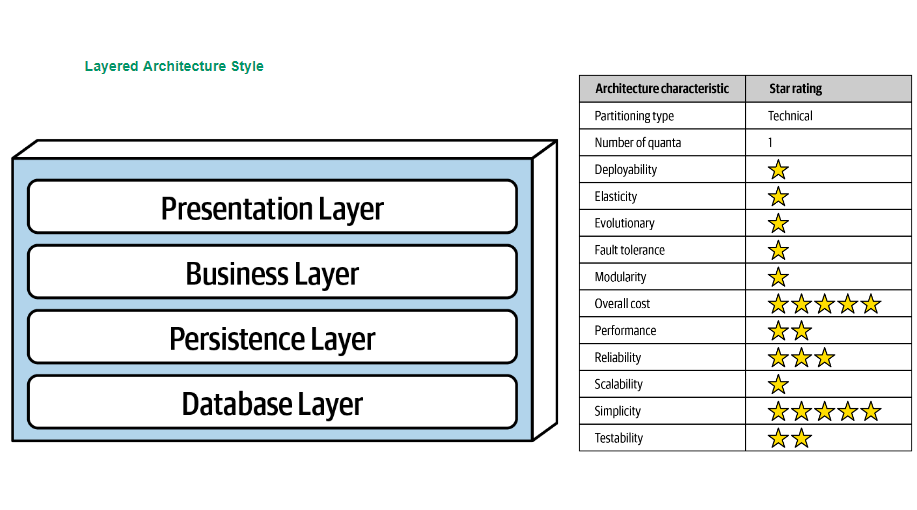
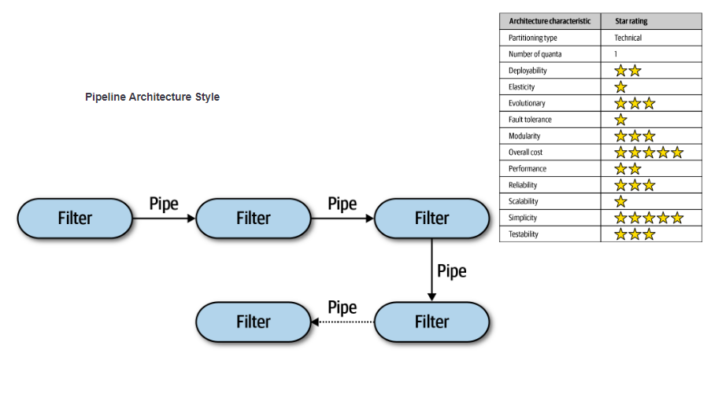
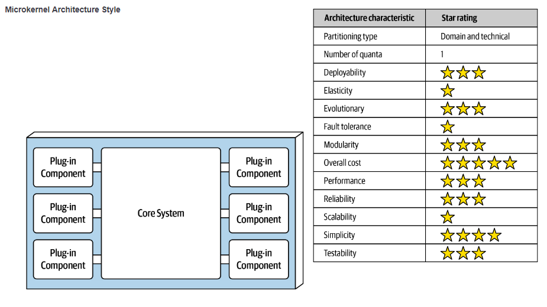
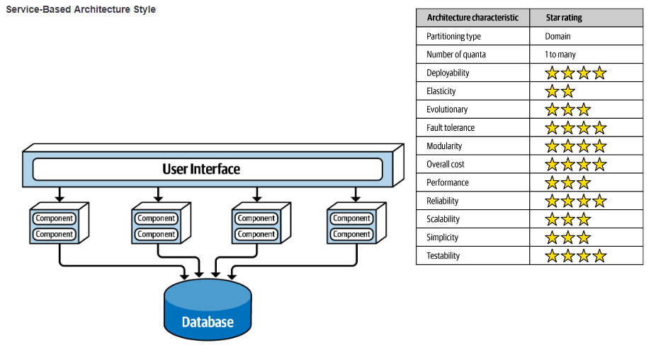
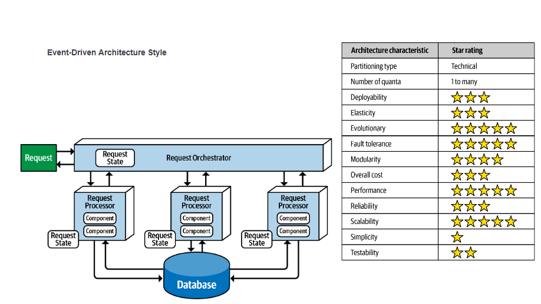
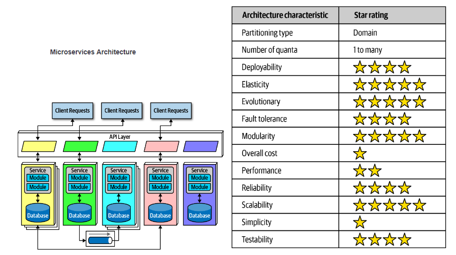

# Engenharia de Software 

ATIVIDADE 1

### Texto: O que é Engenharia de Software?

Within Google, we sometimes say, “Software engineering is programming integrated over time.” Programming is certainly a significant part of software : engineering after all, programming is how you generate new software in the first place. If you accept this distinction, it also becomes clear that we might need to delineate between programming tasks (development) and software engineering tasks (development, modification, maintenance). The addition of time adds an important new dimension to programming. Cubes aren’t squares, distance isn’t velocity. Software engineering isn’t programming.

We see three critical differences between programming and software engineering: time, scale, and the trade-offs at play. On a software engineering project, engineers need to be more concerned with the passage of time and the eventual need for change. In a software engineering organization, we need to be more concerned about scale and efficiency, both for the software we produce as well as for the organization that is producing it. Finally, as software engineers, we are asked to make more complex decisions with higher-stakes outcomes, often based on imprecise estimates of time and growth.

### Comentário: 
* O texto destaca que a engenharia de software difere da programação em três aspectos cruciais: tempo, escala e trade-offs. Tempo envolve planejar para a manutenção e evolução futura do software. Escala refere-se à necessidade de desenvolver sistemas que possam crescer e lidar com grandes volumes de usuários e dados. Trade-offs são as decisões complexas que os engenheiros de software precisam tomar, equilibrando fatores como desempenho e manutenibilidade. Essas diferenças mostram como a engenharia de software é uma prática mais abrangente e estratégica.

### O que é engenharia de software?
R: Engenharia de software é uma disciplina da engenharia que se concentra na aplicação de princípios, métodos e ferramentas para projetar, desenvolver, testar, manter e gerenciar sistemas de software complexos. Ela abrange todo o ciclo de vida do software, desde a concepção inicial até a desativação, com o objetivo de criar software de alta qualidade, eficiente, seguro e escalável. A engenharia de software busca resolver problemas práticos e atender às necessidades dos usuários e das organizações, utilizando abordagens sistemáticas e disciplinadas

ATIVIDADE 2

### De 3 exemplos de trade-off em softwares e explicá-los.

1. Entre otimização de desempenho e consumo de recursos: Muitas vezes é necessário fazer um trade off entre a melhoria no desempenho do programa e o aumento no consumo de recursos do sistema. Por exemplo, aumentar o número de threads em um programa pode melhorar a velocidade de processamento, mas também pode aumentar o uso de memória e CPU.

2. Entre segurança e usabilidade: Implementar medidas de segurança mais rigorosas e manter a facilidade de uso para os usuários. Por exemplo, exigir senhas complexas e autenticação de dois fatores pode aumentar a segurança de um sistema, mas também pode tornar o processo de login mais complicado para os usuários.

3. Entre rapidez no desenvolvimento e qualidade do código: Por vezes, é necessário escolher entre desenvolver um software rapidamente para atender a prazos apertados ou dedicar mais tempo para escrever um código mais limpo e de melhor qualidade. A pressa pode resultar em possíveis bugs e problemas de manutenção no futuro, enquanto a qualidade pode levar mais tempo para ser alcançada.

ATIVIDADE 3

### Um exemplo de cada arquitetura e justifique.

##### Arquitetura em Camadas: Simplicidade e Escalabilidade
  
* A arquitetura em camadas é um estilo de design de software que divide um aplicativo em camadas distintas. Cada camada é responsável por uma função específica e se comunica com as outras camadas por meio de interfaces bem definidas. Esse estilo de arquitetura é frequentemente usado para aplicativos que precisam ser fáceis de usar e manter.

- A arquitetura em camadas promove a simplicidade de várias maneiras:

    - Modularidade: As camadas são módulos independentes que podem ser desenvolvidos, testados e implantados separadamente. Isso facilita o gerenciamento e a manutenção do código-base.
Separação de preocupações: Cada camada é responsável por uma função específica, o que facilita o entendimento do código e torna mais fácil para os desenvolvedores se concentrarem em uma área específica.
Reutilização: As camadas podem ser reutilizadas em diferentes aplicativos, o que pode reduzir o tempo e o custo de desenvolvimento.

- A arquitetura em camadas pode ser escalonada de várias maneiras:

    - Escalabilidade horizontal: Camadas adicionais podem ser adicionadas para aumentar a capacidade do sistema. Por exemplo, uma camada de cache pode ser adicionada para reduzir o tempo de resposta do sistema.
Escalabilidade vertical: Os recursos das camadas existentes podem ser aumentados. Por exemplo, o hardware ou software de um servidor pode ser atualizado para aumentar seu desempenho.

#### Arquitetura de Pipeline: Simplicidade e Escalabilidade

- A arquitetura de pipeline é um estilo de design de software que divide uma tarefa em etapas menores e sequenciais, que são executadas em paralelo. Essa abordagem visa melhorar o desempenho e a eficiência do sistema, reduzindo o tempo de espera e aumentando a taxa de transferência.
- A arquitetura de pipeline é considerada um estilo simples por vários motivos:
  - Modularidade: O sistema é dividido em módulos independentes e interconectados, facilitando o desenvolvimento, a manutenção e a testabilidade.
  Clareza: O fluxo de dados e o comportamento do sistema são fáceis de entender e visualizar, pois as etapas são bem definidas e sequenciais.
  Predictabilidade: O comportamento do sistema é previsível, pois as etapas são executadas em uma ordem predefinida.
- A arquitetura de pipeline também é considerada escalável por vários motivos:
  - Paralelismo: As etapas do pipeline podem ser executadas em paralelo, aproveitando recursos de hardware e software disponíveis.
    Adição de etapas: Novas etapas podem ser facilmente adicionadas ao pipeline para atender a novos requisitos funcionais.
    Replicação: O pipeline pode ser replicado em vários servidores para aumentar a capacidade de processamento.

#### Arquitetura Microkernel: Overall Cost e Elasticity

* A arquitetura microkernel é um tipo de design de software que separa o núcleo do sistema operacional em um pequeno conjunto de serviços essenciais e os demais componentes em processos separados. Essa abordagem visa melhorar a modularidade, a portabilidade e a segurança do sistema.
- A arquitetura microkernel é considerada uma opção de baixo custo por vários motivos:
  - Simplicidade: O núcleo do sistema é pequeno e simples, o que reduz o custo de desenvolvimento e manutenção.
    Modularidade: Os componentes do sistema são independentes e podem ser facilmente substituídos ou atualizados, o que reduz o custo de upgrades.
    Portabilidade: O núcleo do sistema pode ser facilmente portado para diferentes plataformas de hardware, o que reduz o custo de desenvolvimento para diferentes ambientes.
- A arquitetura microkernel também é considerada elástica por vários motivos:
  - Escalabilidade: O sistema pode ser facilmente escalado adicionando ou removendo recursos de hardware, como CPUs e memória.
    Disponibilidade: Os componentes do sistema podem ser reiniciados ou substituídos sem afetar o funcionamento do núcleo, o que melhora a disponibilidade do sistema.
    Tolerância a falhas: O sistema pode tolerar falhas de hardware ou software, pois os componentes são independentes e podem ser reiniciados ou substituídos sem afetar o funcionamento do núcleo.

#### Arquitetura Baseada em Serviços: Overall Cost e Elasticity
  
* A arquitetura baseada em serviços (SOA) é um estilo de design de software que estrutura um sistema como uma coleção de serviços independentes e interconectados. Essa abordagem visa melhorar a modularidade, flexibilidade, escalabilidade e capacidade de reuso do sistema.
- A arquitetura SOA é considerada uma opção de custo total de propriedade (TCO) relativamente baixo por vários motivos:
  - Modularidade: Os serviços são unidades independentes e podem ser facilmente desenvolvidos, implantados e mantidos separadamente, o que reduz a complexidade e o custo geral do sistema.
    Reuso: Os serviços podem ser reutilizados em diferentes aplicações, o que reduz o tempo e o custo de desenvolvimento.
    Escalabilidade: Os serviços podem ser escalados horizontalmente adicionando ou removendo servidores, o que otimiza o uso dos recursos de hardware e software e reduz custos.
    Flexibilidade: A arquitetura SOA é altamente flexível e pode ser facilmente adaptada para atender às mudanças nos requisitos do negócio, o que reduz a necessidade de grandes reformas no sistema e os custos associados a elas.
- A arquitetura SOA é considerada altamente elástica por vários motivos:
  - Escalabilidade horizontal: Os serviços podem ser escalados horizontalmente adicionando ou removendo servidores, o que permite que o sistema atenda a picos de demanda sem necessidade de grandes investimentos em hardware.
    Carregamento de trabalho distribuído: Os serviços podem ser distribuídos em diferentes servidores, o que balanceia o carregamento de trabalho e melhora o desempenho geral do sistema.
    Tolerância a falhas: Os serviços são independentes e podem ser reiniciados ou substituídos sem afetar o funcionamento do sistema como um todo, o que aumenta a disponibilidade e a confiabilidade do sistema.
    Adaptabilidade: A arquitetura SOA é altamente adaptável e pode ser facilmente modificada para atender às mudanças nos requisitos do negócio, o que permite que o sistema se adapte às mudanças sem grandes interrupções ou perdas de desempenho.

#### Arquitetura Serverless: Simplicity e Evolutionary

* A arquitetura serverless é um estilo de design de software que utiliza serviços de computação em nuvem para executar funções sem a necessidade de gerenciar servidores. Essa abordagem visa simplificar o desenvolvimento e a implantação de aplicações, reduzindo a necessidade de infraestrutura e operações.
- A arquitetura serverless é considerada uma opção de alta simplicidade por vários motivos:
  - Abstração de infraestrutura: Os desenvolvedores não precisam se preocupar com a provisionamento, configuração e gerenciamento de servidores, pois esses aspectos são gerenciados pelo provedor de nuvem.
    Foco no código: Os desenvolvedores podem se concentrar em escrever o código das suas aplicações, sem se preocupar com a infraestrutura subjacente.
    Escalabilidade automática: As aplicações serverless escalam automaticamente para cima ou para baixo em resposta à demanda, sem necessidade de intervenção manual.
    Pagamento por uso: Os desenvolvedores pagam apenas pelos recursos que usam, o que pode reduzir significativamente os custos.
- A arquitetura serverless também é considerada altamente evolutiva por vários motivos:
  - Desenvolvimento incremental: As aplicações serverless podem ser desenvolvidas e implantadas incrementalmente, em pequenas iterações.
    Facilidade de teste: As aplicações serverless são fáceis de testar, pois não há necessidade de configurar e gerenciar servidores de teste.
    Implementação rápida: As aplicações serverless podem ser implantadas rapidamente, pois não há necessidade de provisionar ou configurar servidores.
    Facilidade de refatoração: As aplicações serverless são fáceis de refatorar, pois o código é independente da infraestrutura.

#### Arquitetura de Microsserviços: Modularidade e Overall Cost

* A arquitetura de microsserviços é um estilo de design de software que estrutura um sistema como uma coleção de serviços independentes e interconectados. Essa abordagem visa melhorar a modularidade, flexibilidade, escalabilidade e capacidade de reuso do sistema.
- A arquitetura de microsserviços é considerada altamente modular por vários motivos:
  - Serviços independentes: Os microsserviços são unidades autônomas e podem ser desenvolvidos, implantados e mantidos separadamente, o que facilita o gerenciamento e a evolução do sistema.
    Coesão forte: Cada microsserviço é responsável por uma única função bem definida, o que facilita o entendimento e a manutenção do código.
    Limites de serviço claros: Os limites entre os microsserviços são bem definidos, o que facilita a comunicação e o isolamento de falhas.
- O overall cost da arquitetura de microsserviços pode ser variável, dependendo da implementação específica. De um lado, os microsserviços podem reduzir o overall cost em alguns casos:
  - Desenvolvimento incremental: Os microsserviços podem ser desenvolvidos e implantados incrementalmente, em pequenas iterações, o que pode reduzir o custo total do projeto.
    Reuso de código: Os microsserviços podem ser reutilizados em diferentes aplicações, o que pode reduzir o tempo e o custo de desenvolvimento.
    Escalabilidade horizontal: Os microsserviços podem ser escalados horizontalmente adicionando ou removendo servidores, o que otimiza o uso dos recursos de hardware e software e reduz custos.
- Do outro lado, os microsserviços podem aumentar o overall cost em outros casos:
  - Complexidade: A arquitetura de microsserviços pode ser mais complexa de implementar e gerenciar do que uma arquitetura monolítica, o que pode aumentar os custos de operação.
    Infraestrutura: Os microsserviços podem exigir mais infraestrutura do que uma arquitetura monolítica, o que pode aumentar os custos de hardware e software.
    Monitoramento: O monitoramento do desempenho e da utilização dos microsserviços pode ser mais desafiador do que o monitoramento de uma arquitetura monolítica, o que pode aumentar os custos de operação.

ATIVIDADE 4

### Escolha uma arquitetura e ustifique o motivo

Sistema: Spotify
Arquitetura: Microservices Architecture
Trade-Offs:

Performance: O Spotify precisa garantir alta performance em termos de tempo de carregamento de músicas e reprodução sem interrupções. Isso pode resultar em um consumo maior de recursos do sistema e uma possível diminuição da autonomia da bateria do dispositivo.

- Segurança: Para proteger os dados dos usuários contra possíveis ataques cibernéticos e garantir a integridade das informações, o Spotify pode precisar implementar medidas de segurança adicionais, como criptografia de dados e autenticação de dois fatores. Isso pode afetar a velocidade de acesso à plataforma.
- Confiabilidade: Para garantir que o serviço do Spotify seja sempre disponível para os usuários, a plataforma pode precisar investir em infraestrutura de redundância e sistemas de backup. Isso pode resultar em um aumento nos custos operacionais e na complexidade da manutenção da plataforma.
- Escalabilidade: Com o aumento constante do número de usuários e do volume de dados gerados, o Spotify pode precisar garantir que sua plataforma seja escalável para lidar com o crescimento da demanda. Isso pode exigir investimentos em servidores adicionais e tecnologias de escalonamento horizontal, o que pode aumentar os custos de operação.
- Usabilidade: Para oferecer uma experiência de usuário intuitiva e fácil de usar, o Spotify pode precisar investir em design de interface de usuário e testes de usabilidade. Isso pode resultar em um esforço adicional de desenvolvimento e alocar recursos que poderiam ser utilizados em outras atividades.

Diagrama de Classe

### Faça um diagrama baseado na sua arquitetura acima.
Spotify: Playlist - Usuarios - Musicas

Vídeo

https://github.com/BispoJPM/Bertoti/assets/142633184/16008f4a-9c46-41b7-9245-c2b701006e97

